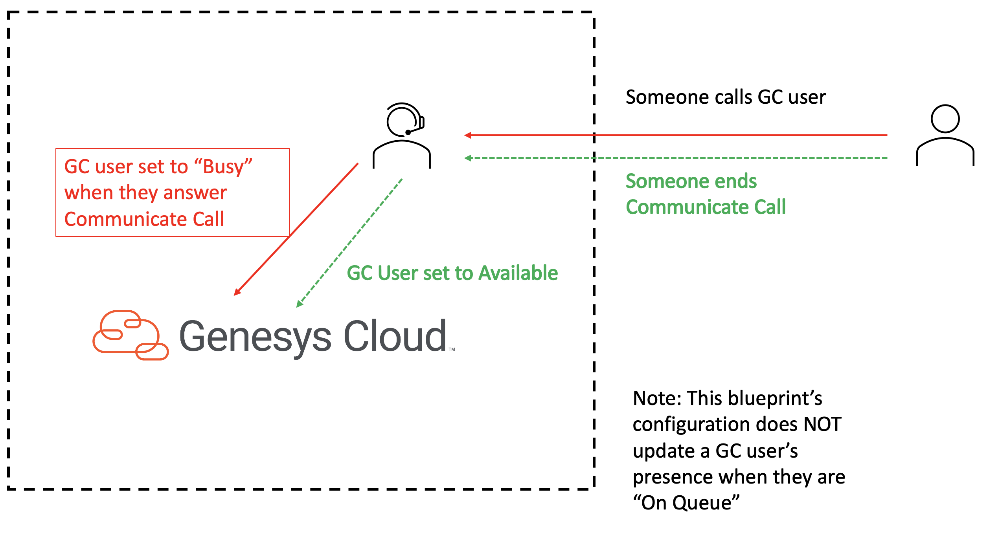

# Update the presence of a Genesys Cloud user based on the answer of a Communicate call

This Genesys Cloud Developer Blueprint explains how to set up Genesys Cloud to update a Genesys Cloud user's presence when the user answers an inbound non-ACD or PBX Communicate call.

When an Architect workflow receives a Communicate call trigger, a Genesys Cloud Public API call is made to update the presence of the Genesys Cloud user on the Communicate call when your customer answers the Communicate call.

The following shows the end-to-end user experience that this solution enables.

