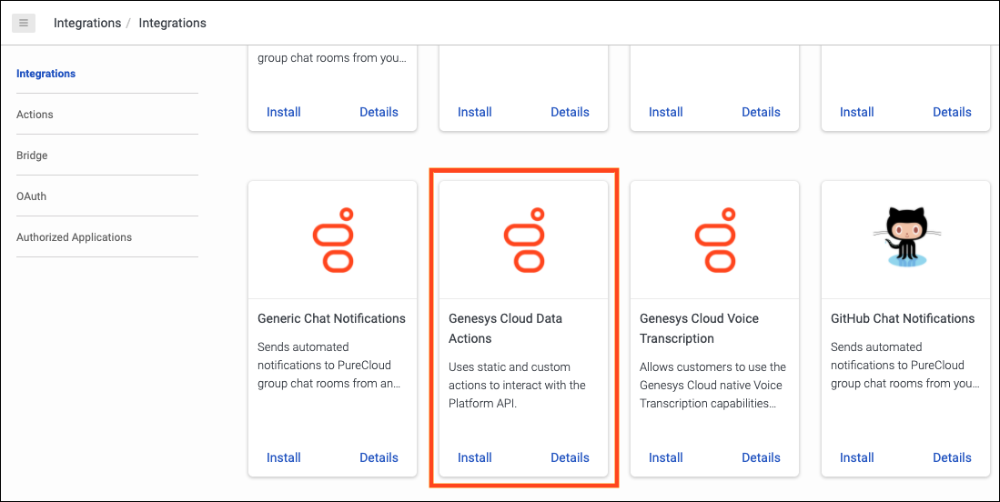
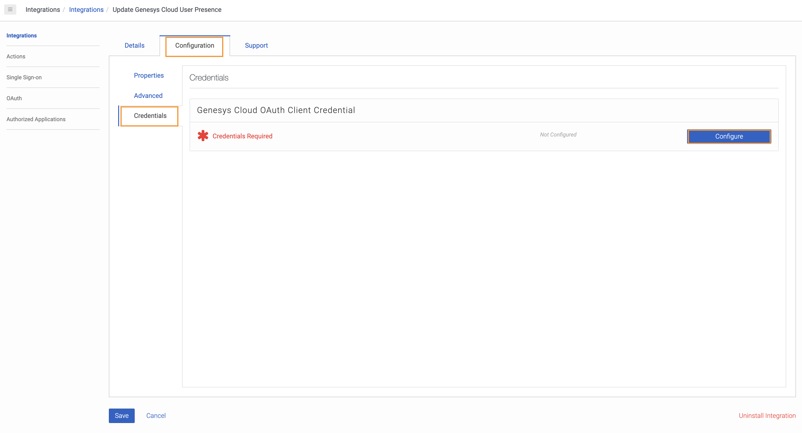
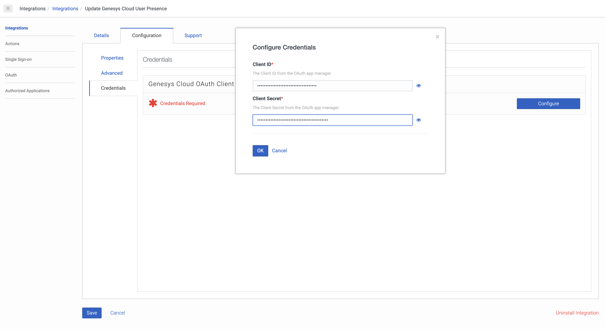
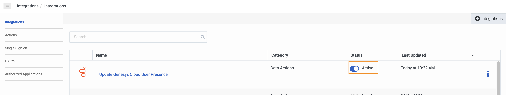
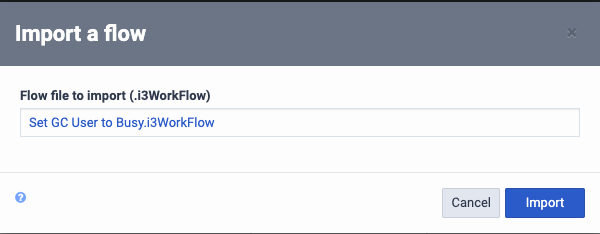
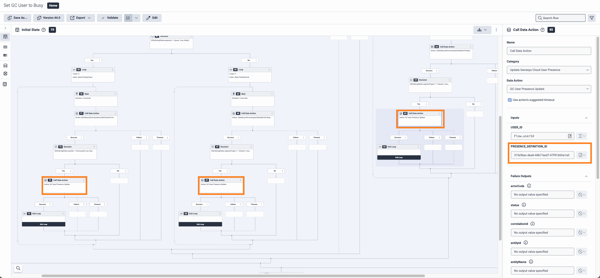
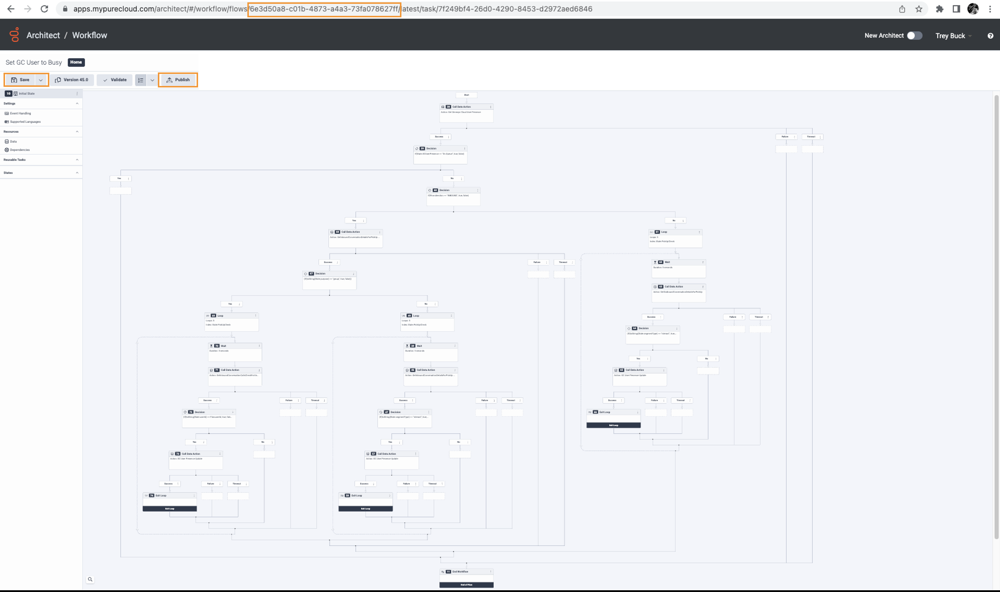

This Genesys Cloud Developer Blueprint explains how to set up Genesys Cloud to update a Genesys Cloud user's presence when the user answers an inbound non-ACD or PBX Communicate call.

When an Architect workflow receives a Communicate call trigger, a Genesys Cloud Public API call is made to update the presence of the Genesys Cloud user on the Communicate call when your customer answers the Communicate call.


The following illustration shows the end-to-end user experience that this solution enables.


## Solution components

* **Genesys Cloud** - A suite of Genesys cloud services for enterprise-grade communications, collaboration, and contact center management. Contact center agents use the Genesys Cloud user interface.
* **Genesys Cloud API** - A set of RESTful APIs that enables you to extend and customize your Genesys Cloud environment.
* **Postman** - A platform for creating and sharing APIs.

## Prerequisites

### Specialized knowledge

* Administrator-level knowledge of Genesys Cloud
* Experience with REST API authentication
* Experience with Postman

### Genesys Cloud account

* A Genesys Cloud CX 2 license. For more information, see [Genesys Cloud Pricing](https://www.genesys.com/pricing "Opens the Genesys Cloud pricing article").
* The Master Admin role in Genesys Cloud. For more information, see [Roles and permissions overview](https://help.mypurecloud.com/?p=24360 "Opens the Roles and permissions overview article") in the Genesys Cloud Resource Center.

## Configure Genesys Cloud

### Create custom roles for use with Genesys Cloud OAuth clients

Create three custom roles for use with Genesys Cloud OAuth clients with the following permissions:

| Roles           | Permissions | Role Name |
|-----------------|-------------------------|---------|
| Custom role 1 | **Process Automation** > **Trigger** > **All Permissions** | Process Automation Trigger Admin |
| Custom role 2 | **Presence** > **All Permissions** | Presence API Admin |
| Custom role 3 | **Analytics** > **Conversation Details** > **View** | ConversationReadPublic API Admin |

To create a custom role in Genesys Cloud:

1. Navigate to **Admin** > **Roles/Permissions** and click **Add Role**.

   

2. Enter the **Name** for your custom role.

    

3. Search and select the required permission for each of the custom role.
   
4. Click **Save** to assign the appropirate permission to your custom role.
   
:::primary
  **Note:** Assign these three custom roles to your user before creating the Genesys Cloud OAuth client. Activate the Event Orchestration in your Genesys Cloud organization for the **Process Automation** > **Trigger** > **All Permissions** permission to be available.
  :::

### Create OAuth clients for use with Genesys Cloud data action integrations

To enable a Genesys Cloud data action to make public API requests on behalf of your Genesys Cloud organization, use an OAuth client to configure authentication with Genesys Cloud.

Create three OAuth clients for use with the data action integration with the following custom roles:

| OAuth Client   | Custom role | OAuth Client Name |
|----------------|-------------------------------|-------|
| OAuth Client 1 | Presence role (Custom role 2) | Presence Public API |
| OAuth Client 2 | ConversationReadPublic API role (Custom role 3) | GetConversationDetailsPublic API |
| OAuth Client 3 | Event Orchestration trigger (Custom role 1) | GC Presence Change Trigger OAuth client |

To create an OAuth Client in Genesys Cloud:

1. Navigate to **Admin** > **Integrations** > **OAuth** and click **Add Client**.

   

2. Enter the name for the OAuth client and select **Client Credentials** as the grant type. Click the **Roles** tab and assign the required role for the OAuth client.

     

3. Click **Save**. Copy the client ID and the client secret values for later use.

   

:::primary
  **Note:** Ensure that you copy the client ID and client secret values for each of the OAuth clients.
  :::

### Add Genesys Cloud data action integrations

Add two Genesys cloud data action integrations to call the Genesys Cloud public API to:
* Update the user's presence in Genesys Cloud
* Get the details of the conversation in Genesys Cloud

To create a data action integration for updating user's presence in Genesys Cloud:

1. Navigate to **Admin** > **Integrations** > **Integrations** and install the **Genesys Cloud Data Actions** integration. For more information, see [About the data actions integrations](https://help.mypurecloud.com/?p=209478 "Opens the About the data actions integrations article") in the Genesys Cloud Resource Center.

   

2. Enter a name for the Genesys Cloud data action, such as Update Genesys Cloud User Presence in this blueprint solution.

   

3. On the **Configuration** tab, click **Credentials** and then click **Configure**.

   

4. Enter the client ID and client secret that you saved for the Presence Public API [(OAuth Client 1)](#create-oauth-clients-for-use-with-genesys-cloud-data-action-integrations "Goes to the create an OAuth Client section"). Click **OK** and save the data action.

   

5. Navigate to the Integrations page and set the presence data action integration to **Active**.

   

To create a data action integration for getting the details of a conversation in Genesys Cloud: 
 
1. Navigate to **Admin** > **Integrations** > **Integrations** and install the **Genesys Cloud Data Actions** integration. For more information, see [About the data actions integrations](https://help.mypurecloud.com/?p=209478 "Opens the About the data actions integrations article") in the Genesys Cloud Resource Center.

    

2. Enter a name for the Genesys Cloud data action, such as GetConversationDetailsPublicAPI in this blueprint solution.

    

3. On the **Configuration** tab, click **Credentials** and then click **Configure**.

    

4. Enter the client ID and client secret that you saved for GetConversationDetailsPublic API [(OAuth Client 2)](#create-an-oauth-client-for-use-with-the-genesys-cloud-data-action-integration "Goes to the create an OAuth Client section") to get the conversation details. Click **OK** and save the data action.

    

5. Navigate to the main Integrations page and set the conversation details data action integration to **Active**.

    

### Import the Genesys Cloud data actions

Import the following JSON files from the [update-gc-presence-on-communicate-call-activity-blueprint repo](https://github.com/GenesysCloudBlueprints/update-gc-presence-on-communicate-call-activity-blueprint) GitHub repository:
* `Get-User-Presence-Update.custom.json`
* `GetInboundConversationDetailsForPickUp.custom.json`
* `GetOutboundConversationDetailsForPickUp.custom.json`

Import the `Get-User-Presence-Update.custom.json` file and associate with the Update Genesys Cloud User Presence data action integration, which uses the Presence Public API OAuth client.

1. From the [update-gc-presence-on-communicate-call-activity-blueprint repo](https://github.com/GenesysCloudBlueprints/update-gc-presence-on-communicate-call-activity-blueprint) GitHub repository, download the `GC-User-Presence-Update.custom.json` file.

2. In Genesys Cloud, navigate to **Integrations** > **Actions** and click **Import**.

   

3. Select the `GC-User-Presence-Update.custom.json` file and associate with the [Update Genesys Cloud User Presence](#add-genesys-cloud-data-action-integrations "Goes to the Add Genesys Cloud data action integrations section") integration, and then click **Import Action**.

   

Import the `GetInboundConversationDetailsForPickUp.custom.json` and `GetOutboundConversationDetailsForPickUp.custom.json` files and associate with the GetConversationDetailsPublicAPI data action integration, which uses the GetConversationDetailsPublic API OAuth client.

1. From the [update-gc-presence-on-communicate-call-activity-blueprint repo](https://github.com/GenesysCloudBlueprints/update-gc-presence-on-communicate-call-activity-blueprint) GitHub repository, download the `GetInboundConversationDetailsForPickUp.custom.json` file.

2. In Genesys Cloud, navigate to **Integrations** > **Actions** and click **Import**.

   

3. Select the `GetInboundConversationDetailsForPickUp.custom.json` file and associate it with the [GetConversationDetailsPublicAPI](#add-genesys-cloud-data-action-integrations "Goes to the Add a web services data actions integration section") integration, and then click **Import Action**.

   

4.  From the [update-gc-presence-on-communicate-call-activity-blueprint repo](https://github.com/GenesysCloudBlueprints/update-gc-presence-on-communicate-call-activity-blueprint) GitHub repository, download the `GetOutboundConversationDetailsForPickUp.custom.json` file.

5.  In Genesys Cloud, navigate to **Integrations** > **Actions** and click **Import**.
   

6. Select the `GetOutboundConversationDetailsForPickUp.custom.json` file and associate it with the [GetConversationDetailsPublicAPI](#add-genesys-cloud-data-action-integrations "Goes to the Add a web services data actions integration section") integration, and then click **Import Action**.
   

### Import the Architect workflows

This solution includes two Architect workflows that use the two [data actions integrations](#add-genesys-cloud-data-action-integrations "Goes to the Add a web services data actions integration section"). These workflows update the user's presence in Genesys Cloud:

* The **Set GC User to Busy.i3WorkFlow** workflow is triggered when a Genesys Cloud user makes or receives a Communicate call. This workflow sets the user's presence in Genesys Cloud to `Busy`.

* The **Set GC User to Available_v7-0.i3WorkFlow** workflow is triggered when a Genesys Cloud user leaves a Communicate call. This workflow sets the user's presence in Genesys Cloud to `Available`.

The Event Orchestration trigger invokes these workflows. The workflows in turn calls the Update Genesys Cloud User Presence data action to update the Genesys Cloud user's presence.

First import these workflows to your Genesys Cloud organization:

1. Download the `Set GC User to Busy.i3WorkFlow` file from the [update-gc-presence-on-communicate-call-activity-blueprint repo](https://github.com/GenesysCloudBlueprints/update-gc-presence-on-communicate-call-activity-blueprint) GitHub repository.

2. In Genesys Cloud, navigate to **Admin** > **Architect** > **Flows:Workflow** and click **Add**.

   

3. Enter a name for the workflow and click **Create Flow**.

   

4. From the **Save** menu, click **Import**.

   

5. Select the downloaded **Set GC User to Busy.i3WorkFlow** file and click **Import**.

   

6. Modify the Presence Definition ID. Select the **Call Data Action** boxes that use the **GC User Presence Update** data action. In the **PRESENCE_DEFINITION_ID** field, enter the ID of the desired Genesys Cloud presence value that you want this workflow to set for the users.

   

   :::primary
   **Note:** You can use the `GET /api/v2/presencedefinitions` Genesys Cloud Public API endpoint to get all your presence definition IDs.
   :::

7. Review your workflow. Extract the workflow ID from the URL and save it. The URL is necessary to create the Event Orchestration trigger. Click **Save** and then click **Publish**.


8. Download the **Set GC User to Available.i3WorkFlow** file from the [update-gc-presence-on-communicate-call-activity-blueprint](https://github.com/GenesysCloudBlueprints/update-gc-presence-on-communicate-call-activity-blueprint) GitHub repository.  

9. In Genesys Cloud, navigate to **Admin** > **Architect** > **Flows:Workflow** and click **Add**.

   

10. Enter a name for the workflow and click **Create Flow**.

    

11. From the **Save** menu, click **Import**.

      

12. Select the downloaded **Set GC User to Available_v1-0.i3WorkFlow** file and click **Import**.

      

13. Modify the presence definition ID. Select the **Call Data Action** box that uses the **GC User Presence Update** data action.  In the **PRESENCE_DEFINITION_ID** field, enter the ID of the desired Genesys Cloud presence value that you want this workflow to set for the users.

      

  :::primary
  **Note:** You can use the `GET /api/v2/presencedefinitions` Genesys Cloud Public API endpoint to get all your presence definition IDs.
  :::

14. Review your workflow. Extract the workflow ID from the URL and save it. The URL is necessary to create the Event Orchestration trigger. Click **Save** and then click **Publish**.

      

## Create the event orchestration triggers

Create the triggers that invoke the created Architect workflows. Activate Event Orchestration in your Genesys Cloud organization and install Postman on your local machine.

1. From the [update-gc-presence-on-communicate-call-activity-blueprint](https://github.com/GenesysCloudBlueprints/update-gc-presence-on-communicate-call-activity-blueprint) GitHub repository, download the Genesys Cloud Event Orchestration Trigger API's `postman_collection.json` file.

2. In the Postman UI, click **Import**

   

3. Select the Genesys Cloud Event Orchestration Trigger API's `postman_collection.json` file and click **Import**

   

4. Under the Genesys Cloud Event Orchestration API's folder, select **Genesys Cloud Client Credential Token Creation**. Change your API domain to match the AWS region in which your Genesys Cloud organization is hosted. For example, in this solution, the Genesys Cloud organization is hosted in `us-east-1`.

5. Select the **Authorization** tab. In the **Username** field, enter the client ID from the [OAuth client that you created](#create-an-oauth-client-for-use-with-the-genesys-cloud-data-action-integration "Goes to the Create an OAuth client for use with the Genesys Cloud data action integration section"). In the **Password** field, enter the client secret from the same OAuth client. Click **Send**.

      

6. From the body of the response, copy the **access token**.

     

7. Click **ProcessAutomation Trigger Creation**. On the **Authentication** tab, select **Bearer Token** and enter the saved access token from the previous step.

     

8. Click the **Body** tab. Ensure that you change your API domain to match the AWS region of your hosted Genesys Cloud organization. Replace **my-workflow-id** with the ID of the **Set GC User to Busy** Architect workflow that you created previously. Click **Send**.

     
   
   :::primary
     **Note:** You can use the following JSON string to match the blueprint solution.
   :::

   ```json

     {
       "topicName":"v2.detail.events.conversation.{id}.user.start",
       "name": "GC Communicate Call User Start",
       "target":{
         "id": "my-workflow-id",
         "type": "Workflow" },
         "matchCriteria": [
            {
             "jsonPath": "queueId",
             "operator": "Exists",
             "value": false
             }
             ],
         "enabled": true
     }
     ```

9. To create the second trigger, replace **my-workflow-id** with the ID of the **Set GC User to Available** Architect workflow that you created previously. Repeat the actions defined in step 8 and use the JSON body sample below to match the blueprint solution. Click **Send**.

    

   :::primary
    **Note:** You can use the following JSON string to match the blueprint solution. Modify the IN operator values to match your business requirements.
    :::
    
   ```json
    {
      "topicName":"v2.detail.events.conversation.{id}.user.end",
      "name": "GC Communicate Call User End",
      "target":{
        "id": "my-workflow-id",
        "type": "Workflow" },
        "matchCriteria": [
           {
            "jsonPath": "queueId",
            "operator": "Exists",
            "value": false
            }
            ],
        "enabled": true
    }
   ```
## Additional resources

* [Genesys Cloud API Explorer](https://developer.genesys.cloud/devapps/api-explorer "Opens the GC API Explorer") in the Genesys Cloud Developer Center
* [Genesys Cloud notification triggers](https://developer.genesys.cloud/notificationsalerts/notifications/available-topics "Opens the Available topics page") in the Genesys Cloud Developer Center
* [Prefixes for AWS regions](https://developer.genesys.cloud/platform/api/ "Open the Overview page in the API section") in the Genesys Cloud Developer Center
* [Postman API Platform](https://www.postman.com/ "Goes to the Postman API Platform page") in the Postman documentation
* The [update-gc-presence-on-communicate-call-activity-blueprint repo](https://github.com/GenesysCloudBlueprints/update-gc-presence-on-communicate-call-activity-blueprint "Opens the GitHub repo") repository in GitHub
